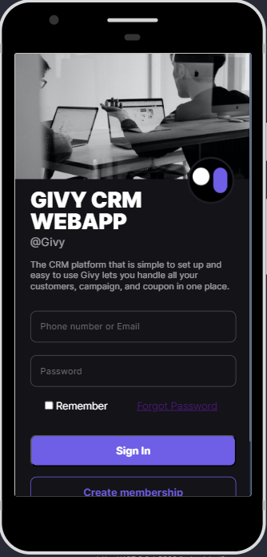

#  Projeto-Mobile-CRM 📲

## o que é CRM?🤔

## O sistema de CRM serve principalmente para centralizar o cadastro de clientes, melhorar o relacionamento com eles e identificar melhores oportunidades de negócios.

# 🎨 Layout

## Você pode visualizar o layout do projeto abaixo!

..............

## 🔎 Tecnologias

## Esse projeto foi desenvolvido com as seguintes tecnologias:

- 🟠HTML 
 
- 🔷CSS

- 🟨JAVASCRIPT

- 🔻GITHUB

-  📌 FIGMA

## 🧑‍💻 Creditos

DEV:[Alisson Barbosa](https://github.com/Alysson-b)

DEV: [Victor Lima](https://github.com/t1viktor)

PROFESSOR: [Luan Oliveira](https://www.linkedin.com/in/luanpdd/)

## 🖥️ Creditos 

### Esse projeto foi desenvolvido a partir do figma https://www.figma.com/@Pimtee_y